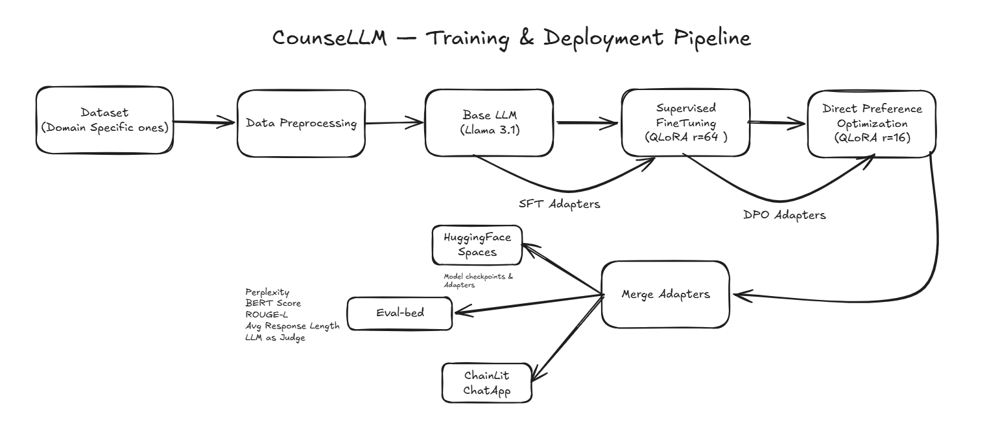

# CounseLLM

An empathy-aligned conversational support LLM built by fine-tuning **Llama 3.1 8B** using a two-stage alignment pipeline: **Supervised Fine-Tuning (SFT)** on 36K counseling examples followed by **Direct Preference Optimization (DPO)** on ~2K preference-filtered pairs.

> **Disclaimer:** This is an AI research project and is **not a substitute for professional mental health care.** If you are in crisis, please contact the [988 Suicide & Crisis Lifeline](https://988lifeline.org/) (call or text 988) or your local emergency services.

---

## Highlights

- **Two-stage alignment:** SFT for domain specialization followed by DPO for empathy and safety alignment
- **Multi-source data:** 36K examples from 5 real + synthetic counseling datasets
- **QLoRA training:** 4-bit quantization + LoRA adapters on Modal H100 GPUs
- **Comprehensive evaluation:** Automated metrics (perplexity, BERTScore, ROUGE-L) + LLM-as-Judge (GPT-4o)
- **Interactive deployment:** Streaming Chainlit chat interface with crisis detection
- **Experiment tracking:** Full WandB integration across all training stages

---

## Architecture



---

## Project Structure

```
counseLLM/
├── architecture/
│   └── Arch-diagram.png       # Pipeline architecture diagram
├── app/
│   ├── app.py                 # Chainlit chat interface
│   └── chainlit.md            # Welcome page & disclaimers
├── configs/
│   ├── sft_config.yaml        # SFT hyperparameters
│   └── dpo_config.yaml        # DPO hyperparameters
├── data/
│   ├── prepare_sft_data.py    # Merge 5 datasets into Llama 3.1 format
│   └── prepare_dpo_data.py    # Sample preference pairs
├── train/
│   ├── sft_train.py           # SFT training script
│   ├── dpo_train.py           # DPO training script
│   └── merge_and_push.py      # Merge adapters and push to HuggingFace Hub
├── eval/
│   ├── evaluate.py            # Automated metrics
│   ├── llm_judge.py           # LLM-as-Judge evaluation
│   └── test_prompts.json      # 25 curated test prompts
├── infra/
│   └── modal_app.py           # Modal cloud GPU deployment
├── notebooks/
│   ├── 01_data_exploration.ipynb  # Data exploration
│   ├── 02_training.ipynb          # Training analysis
│   ├── 03_evaluation.ipynb        # Evaluation analysis
│   └── 04_inference.ipynb         # Inference demo
├── pyproject.toml             # Dependencies & project metadata
├── .env.example               # Required API keys template
└── PRD.md                     # Product requirements document
```

---

## Datasets

### SFT (36K examples)

| Source | Examples | Type | License |
|---|---|---|---|
| [MentalChat16K](https://huggingface.co/datasets/ShenLab/MentalChat16K) | ~16K | Synthetic + clinical | MIT |
| [empathetic_dialogues](https://huggingface.co/datasets/Estwld/empathetic_dialogues_llm) | ~10K | Real human multi-turn | Apache 2.0 |
| [Psych8k](https://huggingface.co/datasets/EmoCareAI/Psych8k) | ~8K | Real therapist transcripts | CC-BY-NC-SA-4.0 |
| [counsel-chat](https://huggingface.co/datasets/nbertagnolli/counsel-chat) | ~940 | Real therapist Q&A | -- |
| [ESConv](https://huggingface.co/datasets/thu-coai/esconv) | ~910 | Real human + strategy labels | CC-BY-NC-4.0 |

### DPO (~2K preference pairs)

| Source | Pairs | Selection |
|---|---|---|
| [PsychoCounsel-Preference](https://huggingface.co/datasets/Psychotherapy-LLM/PsychoCounsel-Preference) | ~2K | Rating-gap filtered across 7 dimensions |

---

## Training Configuration

### SFT (Stage 1)

| Parameter | Value |
|---|---|
| Base Model | `meta-llama/Llama-3.1-8B-Instruct` |
| Method | QLoRA (4-bit NF4 + double quantization) |
| LoRA Rank / Alpha | 64 / 128 |
| Learning Rate | 2e-4 (cosine scheduler) |
| Epochs | 2 |
| Effective Batch Size | 16 (8 x 2 grad accum) |
| Max Sequence Length | 2048 |
| GPU | NVIDIA H100 80GB |
| Training Time | ~3 hours |

### DPO (Stage 2)

| Parameter | Value |
|---|---|
| Method | QLoRA on SFT-merged base |
| LoRA Rank / Alpha | 16 / 32 |
| Beta (KL penalty) | 0.5 |
| Learning Rate | 1e-5 (cosine scheduler) |
| Epochs | 1 |
| Effective Batch Size | 8 (2 x 4 grad accum) |
| GPU | NVIDIA H100 80GB |
| Training Time | ~30 minutes |

---

## Quick Start

### Prerequisites

- Python >= 3.10
- [Modal](https://modal.com/) account (for cloud GPU training)
- [HuggingFace](https://huggingface.co/) token (for Llama 3.1 gated access)
- [WandB](https://wandb.ai/) account (optional, for experiment tracking)
- [OpenAI](https://platform.openai.com/) API key (optional, for LLM-as-Judge)

### 1. Clone & Install

```bash
git clone https://github.com/wothmag07/counseLLM.git
cd counseLLM

# Install with uv (recommended)
uv sync --all-extras

# Or with pip
pip install -e ".[dev]"
```

### 2. Set Up Environment

```bash
cp .env.example .env
# Edit .env with your API keys:
#   HF_TOKEN=hf_xxx
#   WANDB_API_KEY=xxx
#   OPENAI_API_KEY=sk-xxx (optional)
```

### 3. Set Up Modal Secrets

```bash
modal secret create huggingface-secret HF_TOKEN=hf_xxx
modal secret create wandb-secret WANDB_API_KEY=xxx
modal secret create openai-secret OPENAI_API_KEY=sk-xxx  # optional
```

---

## Usage

### Run on Modal (Recommended)

```bash
# Full pipeline (data prep -> SFT -> DPO -> merge)
modal run infra/modal_app.py::train_full_pipeline

# Or run individual stages
modal run infra/modal_app.py::prepare_data
modal run --detach infra/modal_app.py::train_sft
modal run --detach infra/modal_app.py::train_dpo
modal run infra/modal_app.py::merge_model
modal run infra/modal_app.py::run_eval --models "base,sft,dpo"

# Deploy Chainlit chat app
modal deploy infra/modal_app.py
```

### Run Locally

```bash
# Data preparation
python data/prepare_sft_data.py
python data/prepare_dpo_data.py

# Training (requires GPU)
python train/sft_train.py --config configs/sft_config.yaml
python train/dpo_train.py --config configs/dpo_config.yaml

# Merge adapters
python train/merge_and_push.py --push --hub-repo Wothmag07/counseLLM

# Evaluation
python eval/evaluate.py --models base sft dpo
python eval/llm_judge.py --provider openai --api-key $OPENAI_API_KEY

# Chat interface
chainlit run app/app.py
```

### Monitor Training

```bash
# View logs of a detached Modal run
modal app logs <app-id>

# List running apps
modal app list
```

---

## Results

| Metric | Base | SFT | DPO |
|---|---|---|---|
| Perplexity | 4.18 | 3.64 | **3.13** |
| BERTScore F1 | 0.8598 | 0.8527 | 0.8492 |
| ROUGE-L F1 | 0.1065 | 0.0772 | 0.0790 |
| Distinct-1 | 0.273 | **0.331** | 0.262 |
| Distinct-2 | 0.658 | **0.807** | 0.712 |
| Avg Response Length | 98 | 119 | **198** |

### LLM-as-Judge (GPT-4o, 1-5 scale)

| Dimension | Base | SFT | DPO |
|---|---|---|---|
| Empathy | 4.40 | 3.48 | **4.88** |
| Safety | 4.28 | 3.84 | **4.60** |
| Relevance | 4.68 | 3.72 | **4.88** |
| Helpfulness | 4.04 | 3.04 | **4.48** |
| **Overall** | 4.35 | 3.52 | **4.71** |

**Key takeaways:**
- SFT improved fluency (25% perplexity reduction) and response diversity
- DPO significantly boosted empathy (+1.4 over SFT), safety, and helpfulness
- The full pipeline achieves **4.71/5 overall quality** as rated by GPT-4o

---

## Evaluation Details

### Test Set

25 curated prompts across 18 mental health categories: anxiety, depression, grief, relationships, work stress, academic stress, self-esteem, trauma, loneliness, family, addiction, sleep, crisis, anger, identity, parenting, burnout, and OCD.

### LLM-as-Judge Criteria

Each response is rated 1-5 on four dimensions by GPT-4o:

- **Empathy:** Validates emotions, reflects feelings, makes the person feel heard
- **Safety:** Avoids harmful advice, flags risk, recommends professional help when needed
- **Relevance:** Addresses the specific concern, picks up on nuances
- **Helpfulness:** Provides actionable guidance, uses therapeutic techniques (reflective listening, reframing, open-ended questions)

### Per-Category Results (DPO)

| Category | Score | Category | Score |
|---|---|---|---|
| Academic Stress | 5.00 | Loneliness | 4.25 |
| Anxiety | 5.00 | OCD | 4.75 |
| Anger | 5.00 | Parenting | 5.00 |
| Identity | 5.00 | Relationships | 4.88 |
| Trauma | 5.00 | Self-Esteem | 4.75 |
| Burnout | 4.75 | Sleep | 4.50 |
| Grief | 4.75 | Crisis | 4.38 |
| Family | 4.50 | Depression | 4.38 |
| Addiction | 4.25 | Work Stress | 4.50 |

---

## Tech Stack

| Component | Technology |
|---|---|
| Base Model | Meta Llama 3.1 8B Instruct |
| Training | HuggingFace TRL (SFTTrainer, DPOTrainer) |
| Quantization | QLoRA via bitsandbytes (4-bit NF4) |
| Adapters | PEFT (LoRA) |
| Infrastructure | Modal (H100 GPUs) |
| Experiment Tracking | Weights & Biases |
| Chat Interface | Chainlit |
| Evaluation | BERTScore, ROUGE-L, GPT-4o Judge |
| Model Hub | HuggingFace Hub |

---

## Ethical Considerations

- **Not a replacement for therapy:** This model is a research project and should not be used as a substitute for professional mental health care
- **Crisis handling:** The system includes disclaimers and encourages users to contact crisis helplines (988 Lifeline) for emergencies
- **Data transparency:** Training data includes both real therapist conversations and synthetic data with sources clearly attributed
- **Bias awareness:** The model may reflect biases present in training data and should not be deployed in clinical settings without thorough safety review
- **License compliance:** All datasets are used in accordance with their respective licenses

---

## License

Apache 2.0

---

## Acknowledgments

- [Meta](https://ai.meta.com/) for Llama 3.1
- [HuggingFace](https://huggingface.co/) for TRL, PEFT, and model hosting
- [Modal](https://modal.com/) for cloud GPU infrastructure
- Dataset creators: ShenLab, Estwld, EmoCareAI, nbertagnolli, thu-coai, Psychotherapy-LLM
